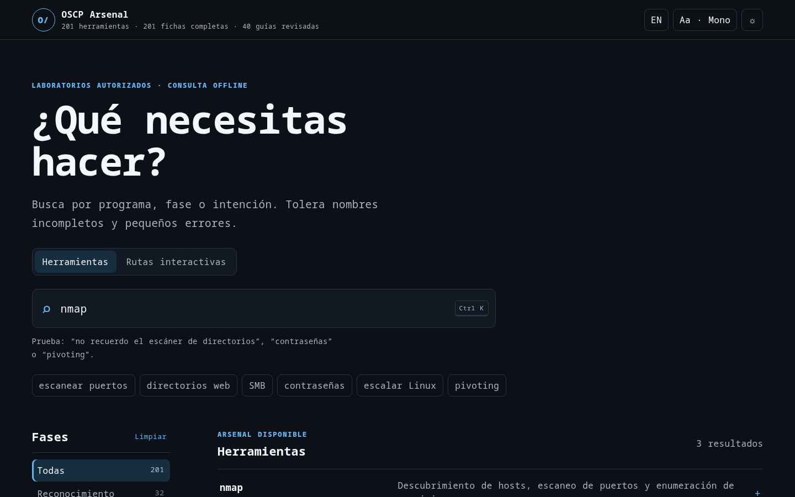
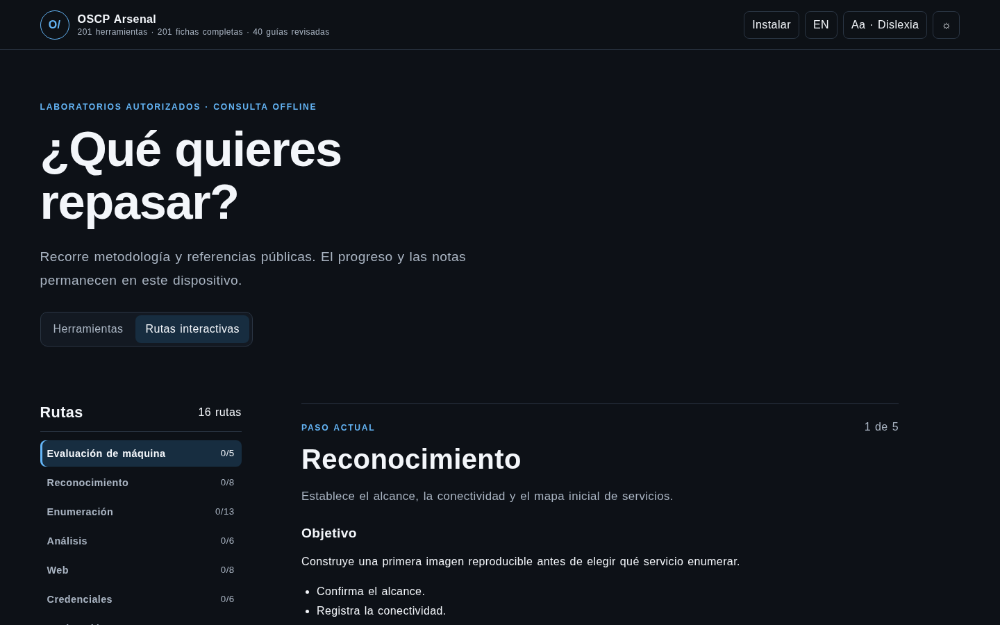

<div align="center">
  
  <h1>OSCP Arsenal</h1>
  <p><strong>Offline-first OSCP tool reference and interactive methodology.</strong><br>
  Referencia OSCP offline con buscador y rutas interactivas.</p>

  <p>
    <a href="https://github.com/0xCyberBerserker/oscp-tool-cheatsheet/actions/workflows/build-all.yml"></a>
    <a href="https://github.com/0xCyberBerserker/oscp-tool-cheatsheet/releases"></a>
    <a href="LICENSE"></a>
    
  </p>

  <p>
    <a href="https://0xcyberberserker.github.io/oscp-tool-cheatsheet/"><strong>Open the PWA</strong></a>
    ·
    <a href="https://github.com/0xCyberBerserker/oscp-tool-cheatsheet/releases/latest">Downloads</a>
    ·
    <a href="#español">Español</a>
  </p>
</div>

<table>
  <tr>
    <td width="50%"></td>
    <td width="50%"></td>
  </tr>
  <tr>
    <td align="center"><strong>201 searchable tool sheets</strong></td>
    <td align="center"><strong>16 interactive paths</strong></td>
  </tr>
</table>

## English

### What it is

OSCP Arsenal is a dependency-free reference built from a verified Kali workstation inventory. It helps you find the right installed tool by name, audit phase or intent, even when the name is incomplete or slightly misspelled.

It also includes interactive public methodology paths with browser-profile-local progress and contextual notes. Nothing is uploaded: the PWA has no telemetry, remote fonts, CDN or runtime backend.

### Highlights

- 201 complete sheets with purpose, syntax, operational recipes and provenance.
- English and Spanish search across tools, phases, objectives and synonyms.
- Typo-tolerant fuzzy matching with bounded input and keyboard navigation.
- 16 interactive paths with a visual step roadmap covering assessment, reconnaissance, enumeration, web, credentials, exploitation, privilege escalation, Active Directory, pivoting and reporting.
- Primary-source links for reviewed recipes and classic Linux fallbacks where a direct fallback exists.
- Installable PWA with verified offline reload.
- Monospaced mode, light/dark themes and reduced-motion support.
- Native Qt 6/QML reader for Linux, Windows and Android.
- Optional encrypted browser profiles bound to an opaque GitHub account subject at [the isolated encrypted origin](https://oscp-arsenal-sync.0xcyberberserker-arsenal.workers.dev).

### Use it

The fastest option is the hosted PWA:

**[Launch OSCP Arsenal](https://0xcyberberserker.github.io/oscp-tool-cheatsheet/)**

For offline desktop use from this repository:

```bash
./scripts/test.sh
./scripts/install.sh
```

The installer creates application-menu and desktop launchers. `app/index.html` also works directly through `file://`; installation as a PWA requires HTTPS or localhost.

Native Qt preview:

```bash
./scripts/test-native.sh
./scripts/install-native.sh
```

### Build and verify

```bash
python3 scripts/build_data.py
python3 scripts/build_knowledge.py
./scripts/test.sh
```

GitHub Actions builds separate Web PWA, Linux x86_64/ARM64, Windows portable/MSI and Android ARM64 artifacts. Release builds from `main` include GitHub OIDC/Sigstore provenance; the Android APK is release-signed only on non-PR `main` builds.

Verify a downloaded artifact:

```bash
gh attestation verify ARTIFACT --repo 0xCyberBerserker/oscp-tool-cheatsheet
```

<details>
<summary>Android release certificate fingerprint</summary>

```text
08:26:6A:81:B6:E4:4E:80:81:42:CD:9E:2D:BB:D6:3E:7A:EF:16:01:98:25:12:EB:7A:69:BC:3C:FD:45:66:66
```

</details>

### Repository map

```text
app/          Static PWA
data/         Verified inventory and curated recipes
knowledge/    Portable public knowledge packs and schemas
native/       Qt 6/QML reader
sync/         Optional GitHub identity Worker and ciphertext-only D1 schema
packaging/    Desktop launchers
scripts/      Build, test and installation commands
tests/        Data, HTML, search and knowledge checks
```

### Refresh the Kali inventory

Run the collector on Kali, review the generated data, then rebuild:

```bash
python3 scripts/inventory_kali.py /tmp/kali-tools.json
python3 scripts/build_data.py
./scripts/test.sh
```

### Authorized use only

Command examples use placeholders and are intended only for systems and laboratories where testing is explicitly authorized. Personal writeups, private targets, credentials and infrastructure-specific integrations do not belong in this public repository.

---

## Español

### Qué es

OSCP Arsenal es una referencia sin dependencias construida desde un inventario verificado de una estación Kali. Permite encontrar la herramienta instalada adecuada por nombre, fase de auditoría o intención, incluso si el nombre está incompleto o contiene pequeños errores.

También incluye rutas públicas de metodología interactiva con progreso y notas contextuales locales al perfil del navegador. Nada se sube: la PWA no contiene telemetría, fuentes remotas, CDN ni backend de runtime.

### Funciones principales

- 201 fichas completas con propósito, sintaxis, recetas operativas y procedencia.
- Búsqueda en English y Español por herramientas, fases, objetivos y sinónimos.
- Búsqueda difusa tolerante a errores, con entrada limitada y navegación por teclado.
- 16 rutas interactivas con roadmap visual sobre evaluación, reconocimiento, enumeración, web, credenciales, explotación, escalada, Active Directory, pivoting e informes.
- Enlaces a fuentes primarias para las recetas revisadas y alternativas clásicas de Linux cuando existe una sustitución directa.
- PWA instalable con recarga offline verificada.
- Modo monoespaciado, temas claro/oscuro y soporte para movimiento reducido.
- Lector nativo Qt 6/QML para Linux, Windows y Android.
- Perfiles cifrados opcionales ligados a un sujeto opaco de GitHub en [el origen cifrado aislado](https://oscp-arsenal-sync.0xcyberberserker-arsenal.workers.dev).

### Uso

La opción más rápida es la PWA publicada:

**[Abrir OSCP Arsenal](https://0xcyberberserker.github.io/oscp-tool-cheatsheet/)**

Para usarla offline desde este repositorio:

```bash
./scripts/test.sh
./scripts/install.sh
```

El instalador crea accesos en el menú de aplicaciones y en el escritorio. `app/index.html` también funciona directamente mediante `file://`; la instalación como PWA requiere HTTPS o localhost.

Vista previa nativa Qt:

```bash
./scripts/test-native.sh
./scripts/install-native.sh
```

### Compilación y verificación

```bash
python3 scripts/build_data.py
python3 scripts/build_knowledge.py
./scripts/test.sh
```

GitHub Actions genera artefactos separados para PWA web, Linux x86_64/ARM64, Windows portable/MSI y Android ARM64. Los builds de release desde `main` incluyen procedencia GitHub OIDC/Sigstore; el APK Android solo se firma para release en builds de `main` ajenos a una PR.

Verifica un artefacto descargado:

```bash
gh attestation verify ARTEFACTO --repo 0xCyberBerserker/oscp-tool-cheatsheet
```

<details>
<summary>Huella del certificado de release Android</summary>

```text
08:26:6A:81:B6:E4:4E:80:81:42:CD:9E:2D:BB:D6:3E:7A:EF:16:01:98:25:12:EB:7A:69:BC:3C:FD:45:66:66
```

</details>

### Estructura del repositorio

```text
app/          PWA estática
data/         Inventario verificado y recetas revisadas
knowledge/    Paquetes públicos portables y esquemas
native/       Lector Qt 6/QML
sync/         Worker opcional de identidad GitHub y esquema D1 solo para ciphertext
packaging/    Lanzadores de escritorio
scripts/      Comandos de build, pruebas e instalación
tests/        Comprobaciones de datos, HTML, búsqueda y conocimiento
```

### Actualizar el inventario de Kali

Ejecuta el recolector en Kali, revisa los datos generados y reconstruye:

```bash
python3 scripts/inventory_kali.py /tmp/kali-tools.json
python3 scripts/build_data.py
./scripts/test.sh
```

### Solo para uso autorizado

Los comandos utilizan placeholders y están destinados únicamente a sistemas y laboratorios donde exista autorización explícita. Los writeups personales, objetivos privados, credenciales e integraciones específicas de una infraestructura no pertenecen a este repositorio público.

<div align="center">
  <strong>Made with 🖤 in Barcelona City 🇪🇸</strong>
</div>
