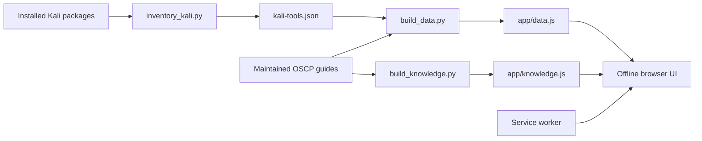

# Architecture / Arquitectura

## English

The application is a static, offline-first document. Build scripts transform a verified Kali inventory and curated guidance into a single browser-ready data file.

- `data/`: source inventory and repository-maintained recipes.
- `scripts/`: deterministic inventory, build, test and install commands.
- `app/`: runtime HTML, CSS, JavaScript and generated data.
- `tests/`: dependency-free structural and search checks.
- `packaging/`: freedesktop launcher.

Trust boundary: inventory data and recipes are build inputs. Rendering uses text nodes rather than interpreting data as HTML. The runtime makes no automatic network requests; official references open only after user action.

The browser client remains usable through `file://`. Over HTTPS or localhost, its
service worker caches only same-origin public assets. Progress and notes use local
browser storage and are never part of generated packs or deployment artifacts.

The current PWA has no application identity. Preferences use `oscp-language`,
`oscp-theme` and the legacy-compatible `oscp-readable` keys. Progress uses
`oscp-path-completed` keyed by `path.id:step.id`; notes use `oscp-path-notes` with
the same contextual key. These plain-text values belong to the browser profile and
web origin, not to a named person. Qt uses per-OS-user `QSettings` under organization
`0xCyberBerserker` and application `OSCP Knowledge Paths`.

Project Pages under `https://0xcyberberserker.github.io` share one web origin even
when their repository paths differ. A separate custom origin is therefore required
before treating browser storage as isolated from other Pages projects.

### Optional encrypted profiles and prepared synchronization

The design rule is **offline-first, serverless-second**. `Knowledge`, `Machine`,
`User` and `Device` remain separate entities. A future machine may own roadmap state,
notes, timestamps, interesting services and checkpoints, but never a writeup. The PWA
uses IndexedDB, Qt will use SQLite, and a versioned JSON format will provide export.
The PWA now includes dependency-free encrypted profiles. GitHub authentication maps the
account to a pseudonymous HMAC subject and never derives encryption keys. AES-256-GCM
protects the random data key and every private record. The optional Worker, OAuth flow
and ciphertext-only D1 schema are prepared under `sync/`, but are not deployed. The local
encrypted snapshot acts as a one-record durable outbox; general conflict resolution,
recovery and native Qt encryption remain pending. See
`docs/security-model.md`.

The portable knowledge-path contract lives in `knowledge/`. It is UI-agnostic and
separates reviewed content from device-local progress. `native/` contains the Qt 6/QML
reader for Linux and the portable base for later Windows and Android builds. It embeds
only reviewed public packs and stores progress through local Qt settings. Control Center
may consume the same pack through an adapter, but operational lab controls remain
outside the standalone product.

Personal writeups, private vaults and infrastructure-specific integrations are outside
this public repository. They belong only in a separate private Control Center adapter.

The single CI workflow validates sources, emits separate Web, Linux, Windows and Android
artifacts, and deploys only the Web PWA from `main`. Android APKs are release-signed only
for non-PR builds from `main`; signing material remains outside the repository.

## Español

La aplicación es un documento estático y preparado para uso offline. Los scripts de build transforman un inventario verificado de Kali y una guía revisada en un único archivo de datos listo para navegador.

- `data/`: inventario fuente y recetas mantenidas por el repositorio.
- `scripts/`: comandos deterministas de inventario, build, prueba e instalación.
- `app/`: HTML, CSS, JavaScript y datos generados para runtime.
- `tests/`: comprobaciones estructurales y de búsqueda sin dependencias.
- `packaging/`: launcher freedesktop.

Límite de confianza: el inventario y las recetas son entradas del build. El renderizado utiliza nodos de texto y no interpreta los datos como HTML. El runtime no realiza peticiones automáticas de red; las referencias oficiales solo se abren por acción del usuario.

El cliente web sigue funcionando mediante `file://`. Bajo HTTPS o localhost, su
service worker guarda únicamente recursos públicos del mismo origen. El progreso y las
notas usan almacenamiento local del navegador y nunca forman parte de los paquetes
generados ni de los artefactos desplegados.

La PWA actual no tiene identidad propia de aplicación. Las preferencias usan las claves
`oscp-language`, `oscp-theme` y la clave legacy compatible `oscp-readable`. El progreso
usa `oscp-path-completed` con claves `path.id:step.id`; las notas usan
`oscp-path-notes` con la misma clave contextual. Estos valores en texto plano pertenecen
al perfil y origen del navegador, no a una persona identificada. Qt usa `QSettings` por
usuario del sistema con organización `0xCyberBerserker` y aplicación
`OSCP Knowledge Paths`.

Los proyectos Pages bajo `https://0xcyberberserker.github.io` comparten un mismo origen
web aunque cambie la ruta del repositorio. Por ello hará falta un origen personalizado
separado antes de considerar el almacenamiento aislado de otros proyectos Pages.

### Perfiles cifrados opcionales y sincronización preparada

La regla de diseño es **offline-first, serverless-second**. `Knowledge`, `Machine`,
`User` y `Device` son entidades separadas. Una futura máquina podrá contener estado del
roadmap, notas, marcas temporales, servicios interesantes y checkpoints, pero nunca un
writeup. La PWA usa IndexedDB, Qt usará SQLite y un JSON versionado permitirá exportar.
La PWA ya incluye perfiles cifrados sin dependencias. GitHub liga la cuenta a un sujeto
HMAC seudónimo y nunca deriva claves de cifrado. AES-256-GCM protege la clave de datos y
cada registro privado. El Worker, OAuth y esquema D1 solo para ciphertext están
preparados en `sync/`, pero no desplegados. El snapshot local cifrado funciona como
outbox duradero de un registro; siguen pendientes la resolución general de conflictos,
recovery y cifrado Qt nativo. Consulta `docs/security-model.md`.

El contrato portable de rutas de conocimiento vive en `knowledge/`. Es independiente de
la UI y separa el contenido revisado del progreso local de cada dispositivo. `native/`
contiene el lector Qt 6/QML para Linux y la base portable de compilaciones posteriores
para Windows y Android. Solo embebe paquetes públicos revisados y guarda el progreso
mediante ajustes locales de Qt. Control Center podrá consumir el mismo paquete mediante
un adaptador, pero los controles operativos del laboratorio quedarán fuera del producto
standalone.

Los writeups personales, las bóvedas privadas y las integraciones específicas de una
infraestructura están fuera de este repositorio público. Solo pertenecerán a un adaptador
privado e independiente de Control Center.

El workflow único de CI valida las fuentes, genera artefactos separados para Web, Linux,
Windows y Android y solo despliega la PWA web desde `main`. Los APK Android se firman para
release únicamente en builds de `main` que no procedan de una PR; el material de firma permanece
fuera del repositorio.
