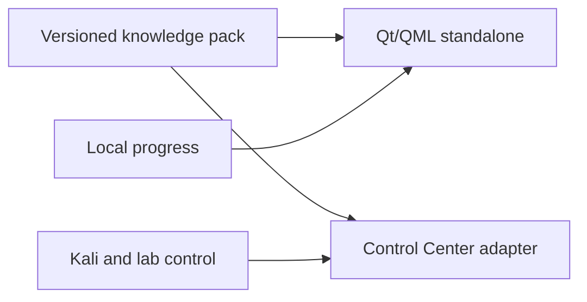

# Knowledge paths / Rutas de conocimiento

## English

This directory defines the portable contract for the future standalone application.
It contains only offline knowledge, navigation and user-progress formats. It never
controls Kali, VPNs, virtual machines, terminals or remote systems.

The canonical model is data-first:

- `schema/knowledge-pack.schema.json`: versioned cards and navigable paths.
- `schema/progress.schema.json`: device-local progress and private annotations.
- `packs/`: public, reviewed content packages.
- `examples/`: synthetic examples without targets, credentials or customer data.

The existing HTML UI remains a presentation shell. Its reviewed JSON guides and search
logic are reusable migration inputs for reference cards, but they do not define paths or
progress. Tool reference is allowed; tool execution is not. Personal writeups, private
vaults and infrastructure-specific integrations are explicitly excluded from this
publicable product and its generated artifacts.

Planned product boundary:

## Español

Este directorio define el contrato portable de la futura aplicación standalone.
Contiene únicamente formatos de conocimiento offline, navegación y progreso. Nunca
controla Kali, VPN, máquinas virtuales, terminales ni sistemas remotos.

El modelo canónico está basado en datos:

- `schema/knowledge-pack.schema.json`: tarjetas versionadas y rutas navegables.
- `schema/progress.schema.json`: progreso local y anotaciones privadas.
- `packs/`: paquetes de contenido público y revisado.
- `examples/`: ejemplos sintéticos sin objetivos, credenciales ni datos de clientes.

La UI HTML actual seguirá siendo una capa de presentación. Sus guías JSON revisadas y su
lógica de búsqueda son entradas de migración reutilizables para tarjetas de referencia,
pero no definen rutas ni progreso. Se permite consultar herramientas, no ejecutarlas.
Los writeups personales, las bóvedas privadas y las integraciones específicas de una
infraestructura quedan expresamente excluidos de este producto publicable y de todos sus
artefactos generados.

Límite de producto:

- Standalone: conocimiento, rutas, búsqueda, notas y progreso.
- Control Center: integración operativa con Kali y el laboratorio.
